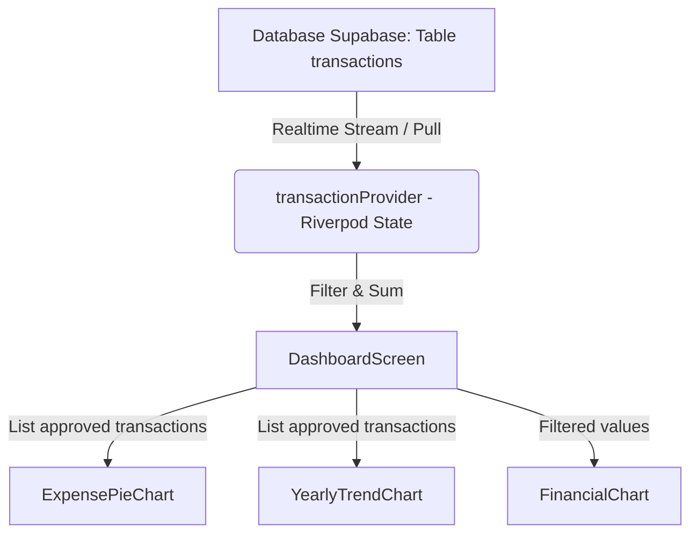

# Dashboard Keuangan Interaktif

## Overview
Dashboard Keuangan Interaktif menyediakan visualisasi data yang lengkap dan mudah dipahami bagi pengurus yayasan. Fitur ini dirancang responsif, interaktif, dan menyajikan metrik analisis mendalam mengenai arus kas (pemasukan vs pengeluaran) dan sebaran pengeluaran berdasarkan kategori akun COA.

---

## Komponen Visualisasi

### 1. Perbandingan Keuangan (`FinancialChart`)
*   **Tipe:** Kelompok Diagram Batang (*Grouped Bar Chart*).
*   **Fungsi:** Membandingkan total Pemasukan (*Income*) dan total Pengeluaran (*Expense*) untuk periode filter terpilih (Bulan Ini atau Semua Waktu).

### 2. Analisis Kategori Pengeluaran (`ExpensePieChart`)
*   **Tipe:** Diagram Donat (*Doughnut Chart*).
*   **Fungsi:** Memecah total pengeluaran yayasan berdasarkan kategori akun COA (misal: beban operasional, gaji, ATK) dalam bentuk persentase kontribusi.
*   **Interaksi:** Titik sentuh/hover pada sektor donat akan memperbesar radius potongan secara interaktif dan menampilkan label persentase kontribusi secara dinamis.
*   **Legend List:** Daftar kategori diurutkan dari pengeluaran nominal terbesar lengkap dengan warna indikator, nama akun COA, persentase, dan nilai rupiah format Indonesia.

### 3. Tren Keuangan Bulanan (`YearlyTrendChart`)
*   **Tipe:** Kurva Garis Ganda (*Double Curved Line Chart*).
*   **Fungsi:** Menggambarkan tren kenaikan/penurunan arus kas bulanan sepanjang tahun (Januari - Desember) untuk tahun yang dipilih.
*   **Dropdown Tahun:** Mengumpulkan data tahun secara dinamis berdasarkan tahun transaksi yang tercatat dalam database yayasan.
*   **Interaksi:** Titik data bulanan dapat ditekan untuk memicu tooltip interaktif yang merinci nilai rupiah pemasukan & pengeluaran di bulan tersebut.

---

## Desain Arsitektur & Aliran Data

Data divisualisasikan secara reaktif langsung dari *state* transaksi yang dimuat di sisi klien (menggunakan data dari `transactionProvider`). Hal ini meminimalkan overhead kueri basis data tambahan ke Supabase.

### File Kode Sumber Terkait
*   **Layar Utama:** [dashboard_screen.dart](file:///Users/ahmadbasymeleh/Documents/Development/Flutter%20Projects/yayasan_finance/lib/features/dashboard/screens/dashboard_screen.dart)
*   **Diagram Batang:** [financial_chart.dart](file:///Users/ahsandbasymeleh/Documents/Development/Flutter%20Projects/yayasan_finance/lib/features/dashboard/widgets/financial_chart.dart)
*   **Diagram Donat:** [expense_pie_chart.dart](file:///Users/ahmadbasymeleh/Documents/Development/Flutter%20Projects/yayasan_finance/lib/features/dashboard/widgets/expense_pie_chart.dart)
*   **Diagram Garis:** [yearly_trend_chart.dart](file:///Users/ahmadbasymeleh/Documents/Development/Flutter%20Projects/yayasan_finance/lib/features/dashboard/widgets/yearly_trend_chart.dart)

---

## Panduan Pengujian Manual

1.  Buka halaman **Dasbor** pada aplikasi.
2.  **Verifikasi Layout Desktop:** Pastikan diagram batang (`FinancialChart`) bersanding sejajar di sebelah diagram donat (`ExpensePieChart`) pada Row 1, dan diagram garis (`YearlyTrendChart`) penuh di Row 2.
3.  **Verifikasi Layout Mobile:** Kecilkan ukuran layar atau buka lewat perangkat ponsel pintar. Pastikan semua kartu ringkasan saldo, grafik batang, grafik donat, dan grafik garis tersusun menumpuk ke bawah secara rapi tanpa *overflow boundary error*.
4.  **Uji Interaktivitas Grafik Donat:** Tekan salah satu potongan diagram donat. Pastikan potongan tersebut membesar dan menampilkan label persentase.
5.  **Uji Dropdown Tahun:** Ubah tahun pada dropdown kanan atas grafik tren bulanan ke tahun sebelumnya, pastikan data bulanan ter-refresh secara akurat.
