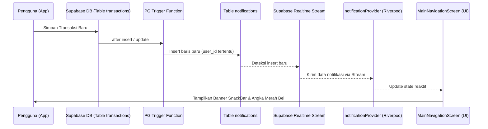

# Sistem Notifikasi Transaksi Baru (In-App Notification)

## Overview
Sistem Notifikasi Transaksi Baru (In-App Notification) menyediakan sarana komunikasi *realtime* di dalam aplikasi untuk menginfokan aktivitas keuangan penting kepada pengurus yayasan. Fitur ini dirancang reaktif sehingga pengguna mendapat pembaruan instan tanpa perlu memuat ulang halaman secara manual.

---

## Skenario Pemicu Notifikasi (Database Triggers)
Notifikasi dibuat secara otomatis di sisi server database menggunakan trigger PostgreSQL saat terjadi aktivitas transaksi tertentu pada tabel `transactions`:

1.  **Persetujuan Pengeluaran Pendek (Pending Approval):**
    *   **Pemicu:** Transaksi uang keluar (expense) bernominal `>= Rp1.000.000` dicatat oleh pengguna dengan peran `bendahara`.
    *   **Penerima:** Seluruh anggota yayasan dengan peran `admin` (Pimpinan).
    *   **Tipe:** `pending_approval`
2.  **Pemasukan Nominal Besar (Large Income):**
    *   **Pemicu:** Transaksi uang masuk (income) bernominal `>= Rp1.000.000` berhasil ditambahkan (misal donasi besar atau wakaf).
    *   **Penerima:** Seluruh anggota aktif yayasan (`admin`, `bendahara`, `viewer`).
    *   **Tipe:** `large_income`
3.  **Perubahan Status Pengajuan (Status Changed):**
    *   **Pemicu:** Transaksi bertipe pending diubah statusnya menjadi disetujui (`approved`) atau ditolak (`rejected`) oleh admin.
    *   **Penerima:** Pengguna yang mengajukan/mencatat transaksi tersebut (`created_by`).
    *   **Tipe:** `status_changed`

---

## Desain Arsitektur Kode & Aliran Data Realtime

### 1. Database Schema
*   **Kueri DDL:** [notification_schema.sql](file:///Users/ahmadbasymeleh/Documents/Development/Flutter%20Projects/yayasan_finance/supabase/notification_schema.sql)
    *   Mendefinisikan tabel `public.notifications`, RLS policies, trigger `handle_transaction_notifications()`, dan mendaftarkan tabel ke dalam publikasi realtime Supabase.

### 2. Model & Service Layer
*   **Model:** [notification_model.dart](file:///Users/ahmadbasymeleh/Documents/Development/Flutter%20Projects/yayasan_finance/lib/features/notifications/models/notification_model.dart)
    *   Mendefinisikan properti, parser JSON, dan utilitas copy-with data notifikasi.
*   **Service:** [notification_service.dart](file:///Users/ahmadbasymeleh/Documents/Development/Flutter%20Projects/yayasan_finance/lib/features/notifications/services/notification_service.dart)
    *   Menyediakan fungsi penandaan status baca (`markAsRead`/`markAllAsRead`) dan map stream realtime menggunakan Supabase Stream SDK `.stream(primaryKey: ['id'])`.

### 3. State Management
*   **Provider:** [notification_provider.dart](file:///Users/ahmadbasymeleh/Documents/Development/Flutter%20Projects/yayasan_finance/lib/features/notifications/providers/notification_provider.dart)
    *   Mendengarkan stream dari service secara reaktif.
    *   Mendeteksi notifikasi masuk baru yang belum dibaca dan mengeksposnya sebagai `lastNewNotification` untuk memicu banner UI.
    *   Secara otomatis mengelola subscribe/unsubscribe berdasarkan perubahan status autentikasi pengguna aktif.

### 4. UI Layer
*   **Main Navigation:** [main_navigation_screen.dart](file:///Users/ahmadbasymeleh/Documents/Development/Flutter%20Projects/yayasan_finance/lib/features/dashboard/screens/main_navigation_screen.dart)
    *   **Ikon Bel & Badge:** Menampilkan jumlah notifikasi yang belum dibaca secara dinamis.
    *   **Notification Center:** Dialog pop-up berisi daftar seluruh riwayat notifikasi lengkap dengan ikon tipe, teks deskripsi, dan waktu transaksi.
    *   **In-app Banner:** SnackBar interaktif yang meluncur di bagian bawah layar secara otomatis ketika notifikasi baru terdeteksi. Tombol **"Buka"** pada banner/notifikasi akan otomatis mengarahkan admin ke halaman persetujuan jika jenis notifikasi memerlukan otorisasi.

---

## Panduan Verifikasi Fungsionalitas (Uji Coba Manual)

1.  Jalankan seluruh DDL pada berkas [notification_schema.sql](file:///Users/ahmadbasymeleh/Documents/Development/Flutter%20Projects/yayasan_finance/supabase/notification_schema.sql) di SQL Editor Supabase Anda.
2.  Masuk ke aplikasi sebagai **Bendahara**:
    *   Tambahkan pengeluaran bernilai Rp1.500.000.
3.  Masuk ke aplikasi sebagai **Admin (Pimpinan)** di browser/tab lain:
    *   Seketika banner SnackBar berwarna hijau akan muncul di bawah layar Admin bertuliskan: **"Persetujuan Diperlukan: Pengeluaran baru untuk... membutuhkan persetujuan Anda."**
    *   Klik **Buka** pada SnackBar tersebut, verifikasi halaman otomatis berpindah ke tab **Persetujuan**.
    *   Periksa ikon bel di AppBar kanan atas, pastikan terdapat badge angka merah `1`. Klik bel tersebut untuk membuka panel notifikasi dan verifikasi isinya.
    *   Klik tombol **Setujui** pada transaksi pengeluaran pending tersebut.
4.  Beralih kembali ke akun **Bendahara**:
    *   Seketika banner SnackBar akan meluncur di layar Bendahara memberitahukan: **"Pengajuan Disetujui: Pengajuan pengeluaran Anda untuk... telah disetujui."**
    *   Klik ikon bel di akun bendahara dan pastikan notifikasi tersebut terdaftar di sana sebagai belum dibaca (ditandai titik merah).
