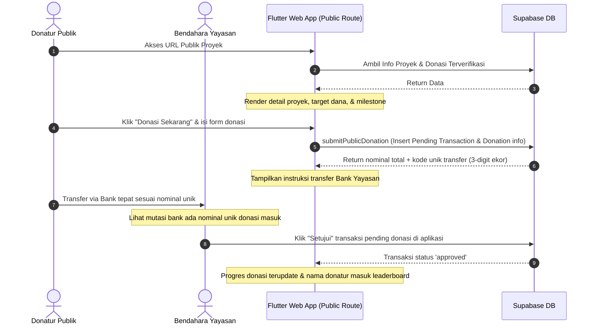

# Crowdfunding Publik & Gamifikasi Proyek Yayasan (Fase 20)

## Overview
Fitur Crowdfunding Publik & Gamifikasi dirancang untuk mempermudah yayasan melakukan pencarian dana (*fundraising*) secara langsung dari publik secara transparan. Fitur ini memungkinkan proyek-proyek tertentu disetel sebagai "Publik" dan dapat diakses oleh donatur umum secara bebas tanpa login (mirip Kickstarter).

---

## Mekanisme Alur Kerja

---

## Implementasi Komponen & Berkas

### A. Database (Supabase)
*   **Migrasi Skema:** [supabase/crowdfunding_schema.sql](file:///Users/ahmadbasymeleh/Documents/Development/Flutter%20Projects/yayasan_finance/supabase/crowdfunding_schema.sql)
    *   Menambahkan kolom `is_public` dan `target_amount` pada tabel `projects`.
    *   Membuat tabel `donations` untuk menampung data donatur publik (nama, email, no WhatsApp, bendera anonim, dan kode unik).
    *   Menerapkan Row Level Security (RLS) agar donatur anonim dapat membaca proyek publik, melihat donasi terverifikasi, dan melakukan submit donasi secara aman tanpa login.

### B. Logic & Services
*   **Project Service:** [project_service.dart](file:///Users/ahmadbasymeleh/Documents/Development/Flutter%20Projects/yayasan_finance/lib/features/projects/services/project_service.dart)
    *   `getPublicProject`: Memuat info proyek publik beserta nominal agregat donasi masuk terverifikasi.
    *   `getProjectDonations`: Mengambil daftar donatur yang donasinya telah disetujui admin/bendahara.
    *   `submitPublicDonation`: Menyimpan transaksi bertipe `income` dengan status `pending` dan nominal transfer + kode unik acak, sekaligus menyisipkan metadata donatur ke tabel `donations`.

### C. Antarmuka Pengguna (UI)
*   **Public Project Page:** [public_project_detail_screen.dart](file:///Users/ahmadbasymeleh/Documents/Development/Flutter%20Projects/yayasan_finance/lib/features/projects/screens/public_project_detail_screen.dart)
    *   Tampilan interaktif ramah ponsel pintar untuk donatur tanpa login.
    *   *Gamified progress bar* melengkung/linear dengan marker milestone persentase target.
    *   Leaderboard donatur terverifikasi (jika anonim ditulis sebagai *"Hamba Allah"*).
*   **Public Donation Dialog:** [public_donation_form_dialog.dart](file:///Users/ahmadbasymeleh/Documents/Development/Flutter%20Projects/yayasan_finance/lib/features/projects/widgets/public_donation_form_dialog.dart)
    *   Form pengumpulan data donatur dengan switch anonimitas.
    *   Tampilan instruksi transfer bank dengan tombol salin nominal & nomor rekening yayasan.

---

## Verifikasi & Skenario Uji Manual

Silakan ikuti instruksi pengujian fungsional pada berkas [walkthrough.md](file:///Users/ahmadbasymeleh/.gemini/antigravity-ide/brain/faf57ca2-7a49-45fa-b029-58c931ec02ec/walkthrough.md) Skenario 15.
