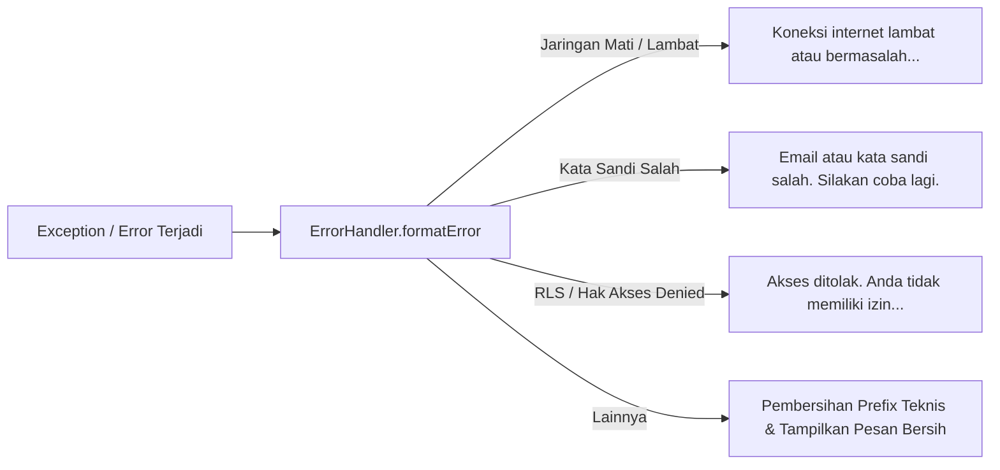

# Penanganan Error Ramah Pengguna (User-Friendly Error Handling)

## Overview
Fitur ini mensentralisasi penerjemahan dan pembersihan pesan kesalahan (error exceptions) teknis mentah dari database Supabase SDK atau sistem jaringan perangkat (seperti `AuthRetryableFetchException` atau `SocketException`) menjadi pesan berbahasa Indonesia yang ramah pengguna. 

Hal ini mencegah kebingungan pengurus yayasan yang diakibatkan oleh munculnya detail stack trace atau detail URL endpoint teknis di antarmuka aplikasi.

---

## Mekanisme Kerja

Semua exception di aplikasi dialirkan melalui utilitas terpusat `ErrorHandler`:

### Implementasi Berkas
*   **Utilitas Handler:** [error_handler.dart](file:///Users/ahmadbasymeleh/Documents/Development/Flutter%20Projects/yayasan_finance/lib/core/utils/error_handler.dart)
*   **Penyedia State Terintegrasi:**
    *   [auth_provider.dart](file:///Users/ahmadbasymeleh/Documents/Development/Flutter%20Projects/yayasan_finance/lib/features/auth/providers/auth_provider.dart) (Login, registrasi, logout)
    *   [foundation_provider.dart](file:///Users/ahmadbasymeleh/Documents/Development/Flutter%20Projects/yayasan_finance/lib/features/foundations/providers/foundation_provider.dart) (Memuat/membuat yayasan, undang anggota)
    *   [transaction_provider.dart](file:///Users/ahmadbasymeleh/Documents/Development/Flutter%20Projects/yayasan_finance/lib/features/transactions/providers/transaction_provider.dart) (Memuat/mengubah/menghapus transaksi, persetujuan)
    *   [coa_provider.dart](file:///Users/ahmadbasymeleh/Documents/Development/Flutter%20Projects/yayasan_finance/lib/features/coa/providers/coa_provider.dart) (Bagan Akun COA)
    *   [project_provider.dart](file:///Users/ahmadbasymeleh/Documents/Development/Flutter%20Projects/yayasan_finance/lib/features/projects/providers/project_provider.dart) (Manajemen Proyek)
    *   [audit_log_provider.dart](file:///Users/ahmadbasymeleh/Documents/Development/Flutter%20Projects/yayasan_finance/lib/features/audit_logs/providers/audit_log_provider.dart) (Log Aktivitas)

---

## Pengujian Manual (Skenario Tes)

1.  **Skenario Offline (Internet Mati):**
    *   Matikan WiFi / Paket Data seluler di perangkat atau simulator Anda.
    *   Buka aplikasi Yayasan Finance (halaman pembuat/pemilih yayasan).
    *   Pastikan aplikasi menampilkan pesan:
        > *Gagal memuat yayasan: Koneksi internet lambat atau bermasalah. Silakan periksa koneksi Anda dan coba lagi.*
2.  **Skenario Salah Password:**
    *   Buka halaman masuk (Login).
    *   Ketik email terdaftar Anda dan masukkan kata sandi sembarang.
    *   Tekan tombol Masuk.
    *   Pastikan pesan eror berbunyi:
        > *Email atau kata sandi salah. Silakan coba lagi.*
